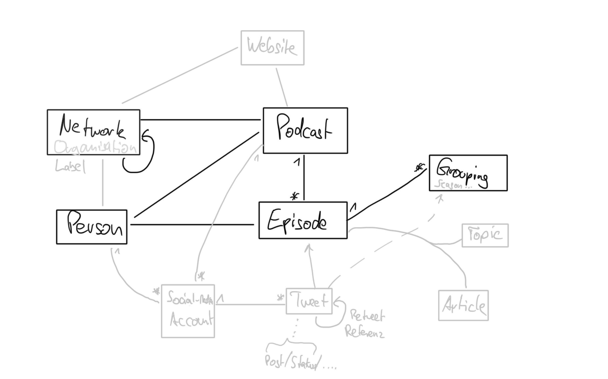
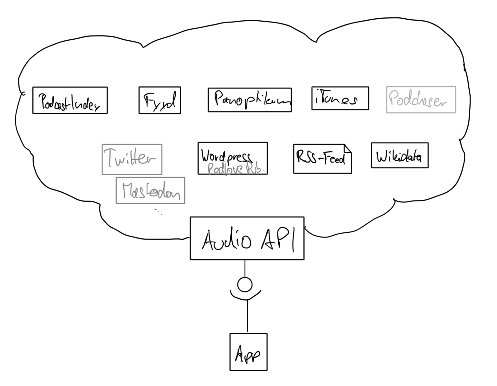

# Audio-API

This projects aims to provide a unified way to access different data sources relevant for the podcast space: 
* Episodes including all metadata related to them, e.g. Contributors, Chapters, Topics and other linked Articles.
* structural information about these episodes, to the Podcast feeds itself but also the corresponding Groupings e.g. Series, Seasons, etc. – combined with information about the publishing Organisation/Network/Label.
* In a later milestone: Collections of podcasts, groupings or episodes curated by users similar to playlists.

# Goals

The primary goal is to decouple data storage/access from the individual apps, e.g. when someone wants to create a visual graph with Podcasts connected by contributors, they do not need to think about, how to get the corresponding data from a directory (like Fyyd.de, Panoptikum.io or PodcastIndex.org); and concentrate on providing a good UI/UX.

